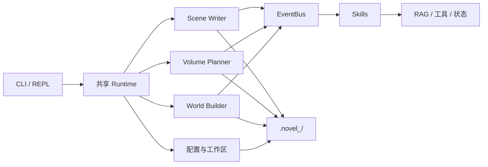

# Novel-Claude

[简体中文](README.md) · [English](README_EN.md) · [日本語](README_JP.md)


> [!IMPORTANT]
> **这是一个新手练手与学习实验作品，不是生产级软件。**
>
> 项目用于学习 Python、LLM API、CLI/REPL、Agent 与 Skill 插件架构。代码和生成结果可能存在缺陷、破坏性变更或额外 API 费用。请勿直接用于生产环境或重要数据，并在操作前备份小说工作区。

Novel-Claude 是一个实验性的长篇小说生成框架。它将世界构建、分卷规划、章节写作和记忆检索组织成一条 CLI 流程，并允许 Skill 通过事件总线注入上下文或工具。

当前上游版本为 **CLI / 交互式 REPL** 架构，不包含 GUI。

## 功能状态

| 能力 | 状态 | 说明 |
|---|---|---|
| 单次 CLI 与交互式 REPL | 已做本地冒烟测试 | 支持帮助、命令路由、项目切换与历史记录 |
| 世界构建、分卷规划、章节写作 | 实验性 | 需要兼容 OpenAI Chat Completions 的模型服务 |
| Skill 插件与热重载 | 实验性 | 插件错误会被隔离，仍建议审查第三方 Skill |
| ChromaDB RAG 记忆 | 实验性 | 内置嵌入实现需要智谱密钥 |
| 智谱 Batch API | 实验性 | 可能产生费用，提交后需保存 Batch ID |
| AI 自动生成 Skill | 高风险实验 | 会生成并写入 Python 代码，使用前请人工审查 |

## 快速开始

需要 Python 3.10+ 和 [uv](https://docs.astral.sh/uv/)。

```bash
git clone https://github.com/wzxsph/Novel-Claude.git
cd Novel-Claude

uv venv
uv pip install -r requirements.txt
cp env.example env
```

编辑 `env`，至少配置聊天模型：

```dotenv
LLM_PROVIDER=minimax
LLM_API_KEY=your-key
LLM_BASE_URL=https://api.minimaxi.com/v1
MODEL_ID=MiniMax-M2.7
FLASH_MODEL_ID=MiniMax-M2.7-highspeed
```

验证安装：

```bash
uv run python cli.py --help
uv run python cli.py skills list
uv run python cli.py --interactive
```

> [!WARNING]
> `init`、`plan`、`write`、`review`、RAG 和 Batch 命令可能调用付费 API。先确认模型、单价、额度和工作区备份。

## 配置

项目从根目录的 `env` 读取密钥，从 `config.json` 读取非敏感的写作参数。

| 变量 | 用途 |
|---|---|
| `LLM_PROVIDER` | 提供商标识；使用智谱时设为 `zhipu` |
| `LLM_API_KEY` | 通用聊天 API 密钥 |
| `LLM_BASE_URL` | OpenAI 兼容接口地址 |
| `MODEL_ID` | 主要生成模型 |
| `FLASH_MODEL_ID` | 小型任务与最小连通性测试模型 |
| `ZHIPU_API_KEY` | 智谱 Batch API 与内置 RAG 嵌入密钥 |
| `BATCH_MODEL_ID` | Batch 请求使用的智谱模型，默认 `glm-4` |
| `NOVEL_NAME` | 可选工作区覆盖，生成 `.novel_<name>/` |

旧版 `MINIMAX_API_KEY`、`MINIMAX_BASE_URL`、`ANTHROPIC_API_KEY`、`ANTHROPIC_BASE_URL` 仍可作为回退。优先级为通用变量 → MiniMax 旧变量 → Anthropic 旧变量。由于运行时使用 OpenAI SDK，已知的 MiniMax `/anthropic` 旧地址会自动转换为 `/v1` OpenAI 兼容地址。

当 `LLM_PROVIDER=zhipu` 且未单独设置 `ZHIPU_API_KEY` 时，智谱功能会复用 `LLM_API_KEY`。其他提供商不会把聊天密钥误传给智谱服务。

`LLM_PROVIDER` 不会替你自动选择聊天端点或模型；`LLM_BASE_URL`、`MODEL_ID` 与密钥必须属于同一个兼容服务。

## 使用方式

### CLI / REPL 命令矩阵

| 任务 | 单次 CLI | 交互式 REPL |
|---|---|---|
| 完整世界构建 | `python cli.py init "一句话创意"` | `init "一句话创意"` |
| 单阶段重跑 | `python cli.py expand` / `python cli.py world` / `python cli.py blueprint` | `expand` / `world` / `blueprint` |
| 全书分卷 | `python cli.py plan` | `plan` |
| 指定卷细纲 | `python cli.py plan 1` 或 `plan --volume 1` | `plan 1` 或 `plan --volume 1` |
| 写章 | `python cli.py write --volume 1 --chapters 1-5` | `write --volume 1 --chapters 1-5` |
| 构建 Batch | `python cli.py batch-build --volume 1 --chapters 1-5` | `batch build --volume 1 --chapters 1-5` |
| 提交 / 同步 Batch | `python cli.py batch-submit <file>` / `python cli.py batch-sync <id>` | `batch submit <file>` / `batch sync <id>` |
| 重建 RAG | `python cli.py reindex --volume 1 --chapters 1-5` | `reindex --volume 1 --chapters 1-5` |
| 审核 | `python cli.py audit --stage 1` 或 `--chapter 1` | `audit --stage 1` 或 `--chapter 1` |
| 实体跟踪 | `python cli.py track --volume 1 --chapter 1` | `track --volume 1 --chapter 1` |
| 多文件 AI 审阅 | `python cli.py review -f <file> -i <要求>` | `review -f <file> -i <要求>` |
| Skill 管理 | `python cli.py skills <list\|enable\|disable\|reload\|build>` | `skills <list\|enable\|disable\|reload\|build>` |
| 项目管理 | — | `projects <create\|switch\|list\|info\|delete>` |
| 工作区文件 | — | `ls` / `cat` / `find` / `cd` / `pwd` |
| 查看 / 修改配置 | — | `settings show` / `settings set <key> <value>` |
| REPL 控制 | — | `/help` / `/history` / `/clear` / `/exit` |

### 单次 CLI

```bash
# 完整世界构建：金手指 → 一句话梗概 → 故事大纲 → 世界设定 → 核心蓝图
uv run python cli.py init "一个关于……的故事"

# 可选：单独重跑某个世界构建阶段
uv run python cli.py expand
uv run python cli.py world
uv run python cli.py blueprint

# 生成全书分卷大纲；再生成第 1 卷细纲
uv run python cli.py plan
uv run python cli.py plan --volume 1
# 也支持：uv run python cli.py plan 1

# 写第 1 卷第 1～5 章
uv run python cli.py write --volume 1 --chapters "1-5"

# 审核与实体跟踪
uv run python cli.py audit --chapter 1
uv run python cli.py track --volume 1 --chapter 1
```

Batch 工作流：

```bash
uv run python cli.py batch-build --volume 1 --chapters "1-10"
uv run python cli.py batch-submit <jsonl_path>
uv run python cli.py batch-sync <batch_id>
```

Skill 管理：

```bash
uv run python cli.py skills list
uv run python cli.py skills enable ext_gold_finger
uv run python cli.py skills disable ext_gold_finger
uv run python cli.py skills reload [name]
uv run python cli.py skills build "描述希望生成的插件"
```

### 交互式 REPL

```bash
uv run python cli.py --interactive
```

REPL 中使用不带 `python cli.py` 的命令，例如：

```text
projects create demo "一句话创意"
projects switch demo
# 返回默认工作区
projects switch default
init "一句话创意"
plan --volume 1
batch build --volume 1 --chapters 1-10
skills list
/help
/exit
```

项目目录统一位于仓库根目录：默认项目为 `.novel/`，命名项目为 `.novel_<name>/`。REPL 的当前项目和历史记录保存在被 Git 忽略的 `.novel_cli_config/`。

## 架构



```text
core/                 EventBus、运行时、插件基类与 Agent
cli/                  REPL、命令分发、项目与设置管理
skills/               可动态加载的 Skill
prompts/              世界、规划、写作和审核提示词
utils/                配置、LLM、Batch、状态与工作区工具
world_builder.py      世界构建
volume_planner.py     分卷、阶段和章节细纲
scene_writer.py       章节生成、渐进保存和 Batch 结果处理
```

## 开发与测试

```bash
python -m compileall -q .
python -m unittest discover -s tests -v
uvx ruff check --select E9,F63,F7,F82 .
```

测试使用 mock 覆盖命令路由、配置与密钥遮蔽、客户端惰性初始化、插件回滚、项目切换、RAG 幂等写入，以及 Batch 构建、提交、轮询和结果解析；不会真实提交 Batch 任务。

## 已知限制

- 不同 OpenAI 兼容服务对流式输出、工具调用和 JSON 格式的支持可能不同。
- RAG 嵌入和 Batch 目前是智谱专用功能，需要单独配置和计费。
- 长篇生成成本高、耗时长，模型也可能产生设定矛盾或不适宜内容。
- 自动生成的 Skill 是可执行 Python 代码；启用前必须人工审查。
- 本项目由新手在学习过程中维护，接口和文件格式可能继续变化。

欢迎提交 Issue 或 PR，但请把它当作学习项目和实验场，而不是稳定产品。

## License

[MIT](LICENSE)
