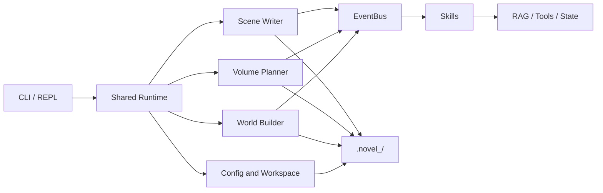

# Novel-Claude

[简体中文](README.md) · [English](README_EN.md) · [日本語](README_JP.md)


> [!IMPORTANT]
> **This is a beginner practice and learning project, not production software.**
>
> It exists to explore Python, LLM APIs, CLI/REPL design, agents, and Skill plugins. The code and generated text may contain defects, breaking changes, or unexpected API costs. Do not use it for production or important data, and back up your novel workspace first.

Novel-Claude is an experimental long-form fiction generation framework. It connects world building, volume planning, chapter writing, and memory retrieval through a CLI pipeline. Skills can add context or model tools through an event bus.

The current upstream version is **CLI / interactive REPL only** and does not include a GUI.

## Feature status

| Capability | Status | Notes |
|---|---|---|
| One-shot CLI and interactive REPL | Locally smoke-tested | Help, routing, project switching, and history |
| World building, planning, and chapter writing | Experimental | Requires an OpenAI Chat Completions-compatible service |
| Skill plugins and hot reload | Experimental | Plugin failures are isolated; review third-party Skills |
| ChromaDB RAG memory | Experimental | Built-in embeddings require a Zhipu API key |
| Zhipu Batch API | Experimental | May incur charges; keep the returned Batch ID |
| AI-generated Skills | High-risk experiment | Generates executable Python; review it before enabling |

## Quick start

Python 3.10+ and [uv](https://docs.astral.sh/uv/) are required.

```bash
git clone https://github.com/wzxsph/Novel-Claude.git
cd Novel-Claude

uv venv
uv pip install -r requirements.txt
cp env.example env
```

Edit `env` and configure at least the chat model:

```dotenv
LLM_PROVIDER=minimax
LLM_API_KEY=your-key
LLM_BASE_URL=https://api.minimaxi.com/v1
MODEL_ID=MiniMax-M2.7
FLASH_MODEL_ID=MiniMax-M2.7-highspeed
```

Verify the installation:

```bash
uv run python cli.py --help
uv run python cli.py skills list
uv run python cli.py --interactive
```

> [!WARNING]
> `init`, `plan`, `write`, `review`, RAG, and Batch commands may call paid APIs. Check the model, pricing, quota, and backups first.

## Configuration

Secrets are read from the root-level `env` file. Non-secret writing defaults live in `config.json`.

| Variable | Purpose |
|---|---|
| `LLM_PROVIDER` | Provider identifier; use `zhipu` for Zhipu |
| `LLM_API_KEY` | Generic chat API key |
| `LLM_BASE_URL` | OpenAI-compatible endpoint |
| `MODEL_ID` | Primary generation model |
| `FLASH_MODEL_ID` | Model for small tasks and connectivity checks |
| `ZHIPU_API_KEY` | Zhipu Batch API and built-in RAG embedding key |
| `BATCH_MODEL_ID` | Zhipu model used in Batch requests; defaults to `glm-4` |
| `NOVEL_NAME` | Optional workspace override, producing `.novel_<name>/` |

Legacy `MINIMAX_API_KEY`, `MINIMAX_BASE_URL`, `ANTHROPIC_API_KEY`, and `ANTHROPIC_BASE_URL` remain supported as fallbacks. Precedence is generic variables → MiniMax legacy variables → Anthropic legacy variables. Because the runtime uses the OpenAI SDK, the known legacy MiniMax `/anthropic` endpoint is normalized to its OpenAI-compatible `/v1` endpoint.

When `LLM_PROVIDER=zhipu`, `LLM_API_KEY` is reused for Zhipu-only features if `ZHIPU_API_KEY` is absent. Keys from other providers are never sent to Zhipu implicitly.

`LLM_PROVIDER` does not select a chat endpoint or model automatically. `LLM_BASE_URL`, `MODEL_ID`, and the key must belong to the same compatible service.

## Usage

### CLI / REPL command matrix

| Task | One-shot CLI | Interactive REPL |
|---|---|---|
| Full world build | `python cli.py init "A one-line idea"` | `init "A one-line idea"` |
| Rerun one stage | `python cli.py expand` / `python cli.py world` / `python cli.py blueprint` | `expand` / `world` / `blueprint` |
| Plan all volumes | `python cli.py plan` | `plan` |
| Plan one volume | `python cli.py plan 1` or `plan --volume 1` | `plan 1` or `plan --volume 1` |
| Write chapters | `python cli.py write --volume 1 --chapters 1-5` | `write --volume 1 --chapters 1-5` |
| Build Batch input | `python cli.py batch-build --volume 1 --chapters 1-5` | `batch build --volume 1 --chapters 1-5` |
| Submit / sync Batch | `python cli.py batch-submit <file>` / `python cli.py batch-sync <id>` | `batch submit <file>` / `batch sync <id>` |
| Rebuild RAG | `python cli.py reindex --volume 1 --chapters 1-5` | `reindex --volume 1 --chapters 1-5` |
| Audit | `python cli.py audit --stage 1` or `--chapter 1` | `audit --stage 1` or `--chapter 1` |
| Track entities | `python cli.py track --volume 1 --chapter 1` | `track --volume 1 --chapter 1` |
| Multi-file AI review | `python cli.py review -f <file> -i <request>` | `review -f <file> -i <request>` |
| Manage Skills | `python cli.py skills <list\|enable\|disable\|reload\|build>` | `skills <list\|enable\|disable\|reload\|build>` |
| Manage projects | — | `projects <create\|switch\|list\|info\|delete>` |
| Workspace files | — | `ls` / `cat` / `find` / `cd` / `pwd` |
| View / change settings | — | `settings show` / `settings set <key> <value>` |
| REPL controls | — | `/help` / `/history` / `/clear` / `/exit` |

### One-shot CLI

```bash
# Full world pipeline: ability → logline → outline → world → blueprint
uv run python cli.py init "A story about ..."

# Optionally rerun one world-building stage
uv run python cli.py expand
uv run python cli.py world
uv run python cli.py blueprint

# Plan all volumes, then volume 1
uv run python cli.py plan
uv run python cli.py plan --volume 1
# Also accepted: uv run python cli.py plan 1

# Write chapters 1 through 5 of volume 1
uv run python cli.py write --volume 1 --chapters "1-5"

# Audit and entity tracking
uv run python cli.py audit --chapter 1
uv run python cli.py track --volume 1 --chapter 1
```

Batch workflow:

```bash
uv run python cli.py batch-build --volume 1 --chapters "1-10"
uv run python cli.py batch-submit <jsonl_path>
uv run python cli.py batch-sync <batch_id>
```

Skill management:

```bash
uv run python cli.py skills list
uv run python cli.py skills enable ext_gold_finger
uv run python cli.py skills disable ext_gold_finger
uv run python cli.py skills reload [name]
uv run python cli.py skills build "Describe the desired plugin"
```

### Interactive REPL

```bash
uv run python cli.py --interactive
```

Commands inside the REPL omit `python cli.py`:

```text
projects create demo "A one-line idea"
projects switch demo
# Return to the default workspace
projects switch default
init "A one-line idea"
plan --volume 1
batch build --volume 1 --chapters 1-10
skills list
/help
/exit
```

Workspaces live in the repository root: `.novel/` for the default project and `.novel_<name>/` for named projects. REPL state and history are stored in the Git-ignored `.novel_cli_config/` directory.

## Architecture



```text
core/                 EventBus, runtime, plugin base, and agents
cli/                  REPL, routing, project, and settings management
skills/               Dynamically loaded Skills
prompts/              World, planning, writing, and audit prompts
utils/                Config, LLM, Batch, state, and workspace utilities
world_builder.py      World-building pipeline
volume_planner.py     Volume, stage, and chapter outlines
scene_writer.py       Chapter generation, progressive saves, Batch results
```

## Development and tests

```bash
python -m compileall -q .
python -m unittest discover -s tests -v
uvx ruff check --select E9,F63,F7,F82 .
```

Mocked tests cover routing, configuration and secret masking, lazy clients, plugin rollback, project switching, idempotent RAG writes, and Batch build, submission, polling, and result parsing. They do not submit a real Batch job.

## Known limitations

- OpenAI-compatible providers differ in streaming, tool-call, and JSON behavior.
- RAG embeddings and Batch are currently Zhipu-specific and separately billed.
- Long-form generation is expensive and can produce continuity errors or unsuitable text.
- Generated Skills are executable Python and must be reviewed manually.
- This beginner-maintained project may continue to change interfaces and file formats.

Issues and pull requests are welcome, but treat this repository as a learning lab rather than a stable product.

## License

[MIT](LICENSE)
