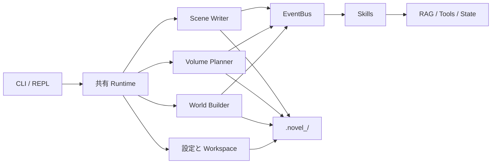

# Novel-Claude

[简体中文](README.md) · [English](README_EN.md) · [日本語](README_JP.md)


> [!IMPORTANT]
> **これは初心者の練習・学習用プロジェクトであり、本番向けソフトウェアではありません。**
>
> Python、LLM API、CLI/REPL、Agent、Skill プラグイン構成を学ぶための実験です。コードや生成文章には不具合、破壊的変更、予想外の API 費用が発生する可能性があります。本番環境や重要データには使わず、先に小説ワークスペースをバックアップしてください。

Novel-Claude は、長編小説生成の実験的フレームワークです。世界設定、巻構成、章執筆、記憶検索を CLI パイプラインで接続し、Skill がイベントバス経由でコンテキストやモデル用ツールを追加できます。

現在の上流版は **CLI / 対話型 REPL 専用**で、GUI は含まれていません。

## 機能ステータス

| 機能 | 状態 | 補足 |
|---|---|---|
| 単発 CLI と対話型 REPL | ローカルでスモークテスト済み | ヘルプ、ルーティング、プロジェクト切替、履歴 |
| 世界設定・巻構成・章執筆 | 実験的 | OpenAI Chat Completions 互換サービスが必要 |
| Skill とホットリロード | 実験的 | エラーは隔離されますが、外部 Skill は要確認 |
| ChromaDB RAG メモリ | 実験的 | 内蔵埋め込みには Zhipu API キーが必要 |
| Zhipu Batch API | 実験的 | 課金の可能性あり。Batch ID を保存してください |
| AI による Skill 生成 | 高リスク実験 | 実行可能な Python を生成するため、必ずレビュー |

## クイックスタート

Python 3.10+ と [uv](https://docs.astral.sh/uv/) が必要です。

```bash
git clone https://github.com/wzxsph/Novel-Claude.git
cd Novel-Claude

uv venv
uv pip install -r requirements.txt
cp env.example env
```

`env` を編集し、最低限チャットモデルを設定します。

```dotenv
LLM_PROVIDER=minimax
LLM_API_KEY=your-key
LLM_BASE_URL=https://api.minimaxi.com/v1
MODEL_ID=MiniMax-M2.7
FLASH_MODEL_ID=MiniMax-M2.7-highspeed
```

インストール確認：

```bash
uv run python cli.py --help
uv run python cli.py skills list
uv run python cli.py --interactive
```

> [!WARNING]
> `init`、`plan`、`write`、`review`、RAG、Batch は有料 API を呼ぶ場合があります。モデル、料金、残高、バックアップを先に確認してください。

## 設定

秘密情報はルートの `env`、非機密の執筆設定は `config.json` から読み込みます。

| 変数 | 用途 |
|---|---|
| `LLM_PROVIDER` | プロバイダー識別子。Zhipu は `zhipu` |
| `LLM_API_KEY` | 汎用チャット API キー |
| `LLM_BASE_URL` | OpenAI 互換エンドポイント |
| `MODEL_ID` | 主生成モデル |
| `FLASH_MODEL_ID` | 小規模処理・接続確認用モデル |
| `ZHIPU_API_KEY` | Zhipu Batch と内蔵 RAG 埋め込み用キー |
| `BATCH_MODEL_ID` | Batch 用 Zhipu モデル。既定値 `glm-4` |
| `NOVEL_NAME` | 任意のワークスペース名。`.novel_<name>/` を使用 |

旧変数 `MINIMAX_API_KEY`、`MINIMAX_BASE_URL`、`ANTHROPIC_API_KEY`、`ANTHROPIC_BASE_URL` もフォールバックとして利用できます。優先順位は汎用変数 → MiniMax 旧変数 → Anthropic 旧変数です。ランタイムは OpenAI SDK を使用するため、既知の MiniMax `/anthropic` 旧エンドポイントは OpenAI 互換の `/v1` に自動変換されます。

`LLM_PROVIDER=zhipu` の場合、`ZHIPU_API_KEY` がなければ Zhipu 専用機能は `LLM_API_KEY` を再利用します。他社のキーを暗黙に Zhipu へ送ることはありません。

`LLM_PROVIDER` はチャットのエンドポイントやモデルを自動選択しません。`LLM_BASE_URL`、`MODEL_ID`、API キーは同じ互換サービスの組み合わせにしてください。

## 使い方

### CLI / REPL コマンド対応表

| 操作 | 単発 CLI | 対話型 REPL |
|---|---|---|
| 世界構築の全工程 | `python cli.py init "一行アイデア"` | `init "一行アイデア"` |
| 単一工程の再実行 | `python cli.py expand` / `python cli.py world` / `python cli.py blueprint` | `expand` / `world` / `blueprint` |
| 全巻構成 | `python cli.py plan` | `plan` |
| 指定巻の詳細構成 | `python cli.py plan 1` または `plan --volume 1` | `plan 1` または `plan --volume 1` |
| 章執筆 | `python cli.py write --volume 1 --chapters 1-5` | `write --volume 1 --chapters 1-5` |
| Batch 入力作成 | `python cli.py batch-build --volume 1 --chapters 1-5` | `batch build --volume 1 --chapters 1-5` |
| Batch 投稿 / 同期 | `python cli.py batch-submit <file>` / `python cli.py batch-sync <id>` | `batch submit <file>` / `batch sync <id>` |
| RAG 再構築 | `python cli.py reindex --volume 1 --chapters 1-5` | `reindex --volume 1 --chapters 1-5` |
| 監査 | `python cli.py audit --stage 1` または `--chapter 1` | `audit --stage 1` または `--chapter 1` |
| エンティティ追跡 | `python cli.py track --volume 1 --chapter 1` | `track --volume 1 --chapter 1` |
| 複数ファイル AI レビュー | `python cli.py review -f <file> -i <指示>` | `review -f <file> -i <指示>` |
| Skill 管理 | `python cli.py skills <list\|enable\|disable\|reload\|build>` | `skills <list\|enable\|disable\|reload\|build>` |
| プロジェクト管理 | — | `projects <create\|switch\|list\|info\|delete>` |
| Workspace ファイル | — | `ls` / `cat` / `find` / `cd` / `pwd` |
| 設定の確認 / 変更 | — | `settings show` / `settings set <key> <value>` |
| REPL 操作 | — | `/help` / `/history` / `/clear` / `/exit` |

### 単発 CLI

```bash
# 世界構築の全工程を実行
uv run python cli.py init "ある物語のアイデア"

# 必要な工程だけ再実行
uv run python cli.py expand
uv run python cli.py world
uv run python cli.py blueprint

# 全巻構成、その後に第1巻の詳細構成
uv run python cli.py plan
uv run python cli.py plan --volume 1
# uv run python cli.py plan 1 も利用可能

# 第1巻の第1～5章を執筆
uv run python cli.py write --volume 1 --chapters "1-5"

# 監査とエンティティ追跡
uv run python cli.py audit --chapter 1
uv run python cli.py track --volume 1 --chapter 1
```

Batch ワークフロー：

```bash
uv run python cli.py batch-build --volume 1 --chapters "1-10"
uv run python cli.py batch-submit <jsonl_path>
uv run python cli.py batch-sync <batch_id>
```

Skill 管理：

```bash
uv run python cli.py skills list
uv run python cli.py skills enable ext_gold_finger
uv run python cli.py skills disable ext_gold_finger
uv run python cli.py skills reload [name]
uv run python cli.py skills build "作りたいプラグインの説明"
```

### 対話型 REPL

```bash
uv run python cli.py --interactive
```

REPL 内では `python cli.py` を省略します。

```text
projects create demo "一行アイデア"
projects switch demo
# 既定ワークスペースへ戻る
projects switch default
init "一行アイデア"
plan --volume 1
batch build --volume 1 --chapters 1-10
skills list
/help
/exit
```

ワークスペースはリポジトリ直下に置かれます。既定は `.novel/`、名前付きは `.novel_<name>/` です。REPL の状態と履歴は Git 管理外の `.novel_cli_config/` に保存されます。

## アーキテクチャ



```text
core/                 EventBus、Runtime、Plugin 基底、Agent
cli/                  REPL、ルーティング、プロジェクト、設定管理
skills/               動的に読み込む Skill
prompts/              世界設定、構成、執筆、監査プロンプト
utils/                設定、LLM、Batch、状態、Workspace
world_builder.py      世界構築パイプライン
volume_planner.py     巻・段階・章のアウトライン
scene_writer.py       章生成、段階保存、Batch 結果処理
```

## 開発とテスト

```bash
python -m compileall -q .
python -m unittest discover -s tests -v
uvx ruff check --select E9,F63,F7,F82 .
```

モックテストは、コマンドルーティング、設定と秘密情報のマスキング、遅延クライアント、Plugin ロールバック、プロジェクト切替、RAG の冪等書き込み、Batch の構築・投稿・ポーリング・結果解析を対象にします。実際の Batch 投稿は行いません。

## 既知の制限

- OpenAI 互換サービスごとにストリーミング、ツール呼び出し、JSON 挙動が異なります。
- RAG 埋め込みと Batch は現在 Zhipu 専用で、別途課金されます。
- 長編生成は高コストで、整合性エラーや不適切な文章が生じる場合があります。
- 自動生成 Skill は実行可能な Python なので、必ず人手で確認してください。
- 初心者が学習しながら保守しているため、API やファイル形式は今後も変わり得ます。

Issue や Pull Request は歓迎しますが、安定製品ではなく学習用ラボとして扱ってください。

## License

[MIT](LICENSE)
